# 一、前言

本项目为接口自动化测试平台后端，python+django+mysql   
[项目前端地址](https://github.com/xifengxixi/platformFrontend)

- 项目参与者：溪风习习
- 个人语雀地址：[https://www.yuque.com/xifengxixi](https://www.yuque.com/xifengxixi)
- 技术支持邮箱：1107872406@qq.com

> 本项目不建议用于实际企业项目，仅为个人练手使用
> 
> 需要练习的朋友可以查看本人语雀项目，有相关笔记。需要教程的朋友，可加Q私信

如果对您有帮助，请点亮本项目的小星星，不胜感激。

# 二、运行方式

## 2.1 安装

```powershell
pip install -r requirements.txt
```

## 2.2 运行

```powershell
python manage.py runserver
```

# 三、平台简介

- 登录注册


- 系统首页

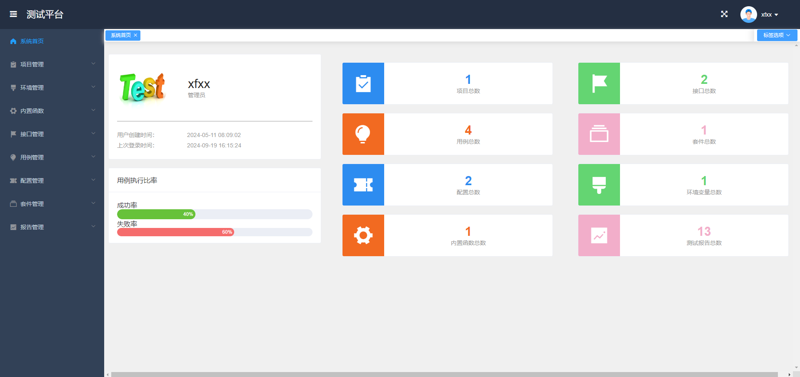

- 项目管理

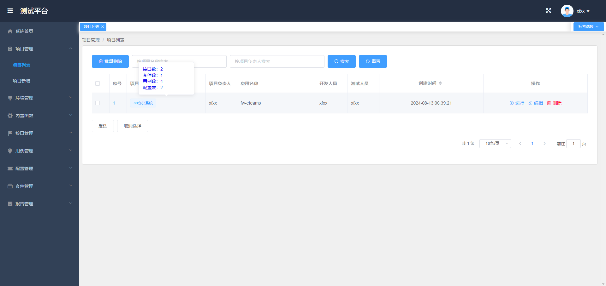

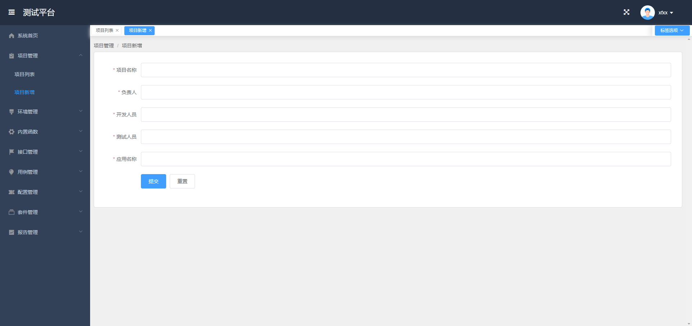

- 环境管理

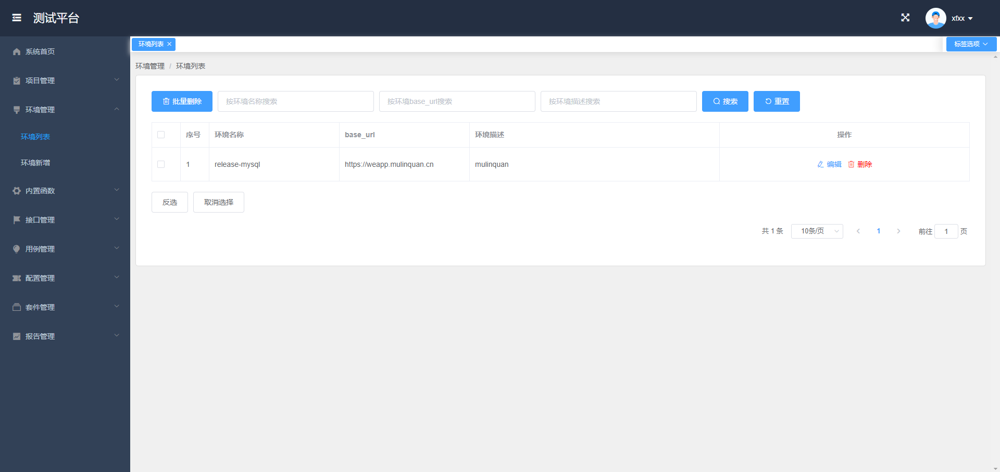

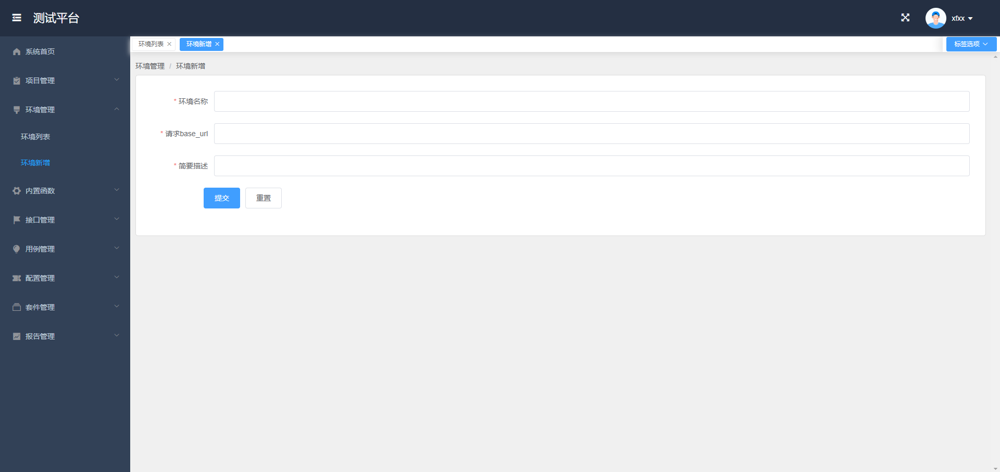

- 内置函数

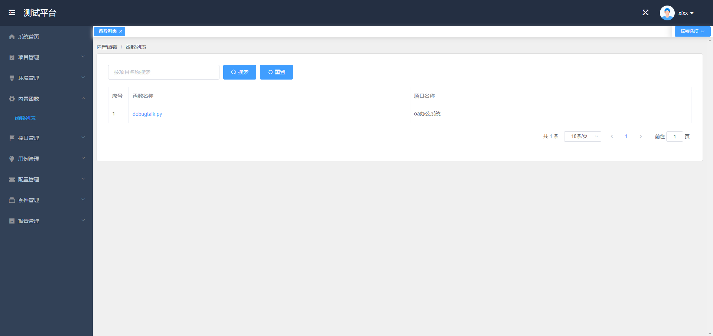

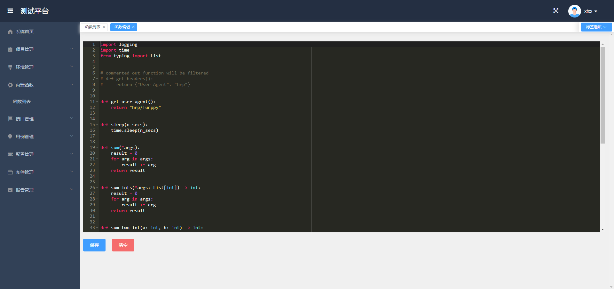

- 接口管理


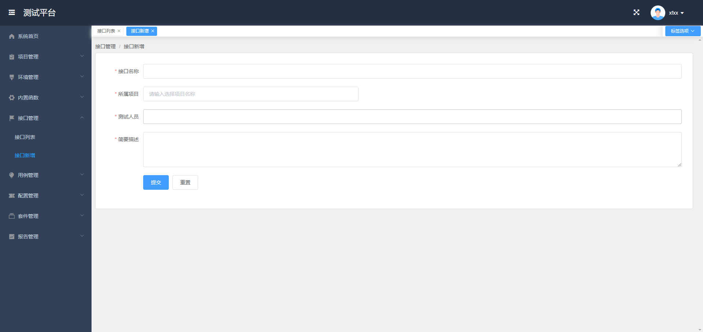

- 用例管理


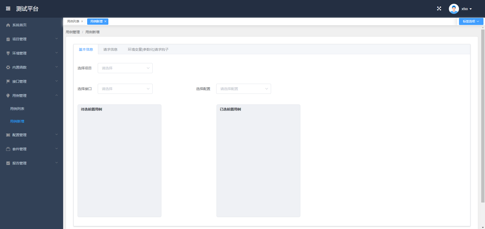

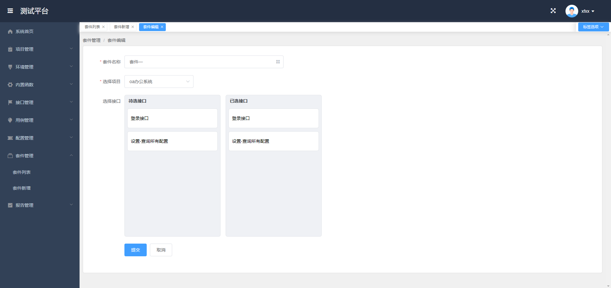

- 配置管理

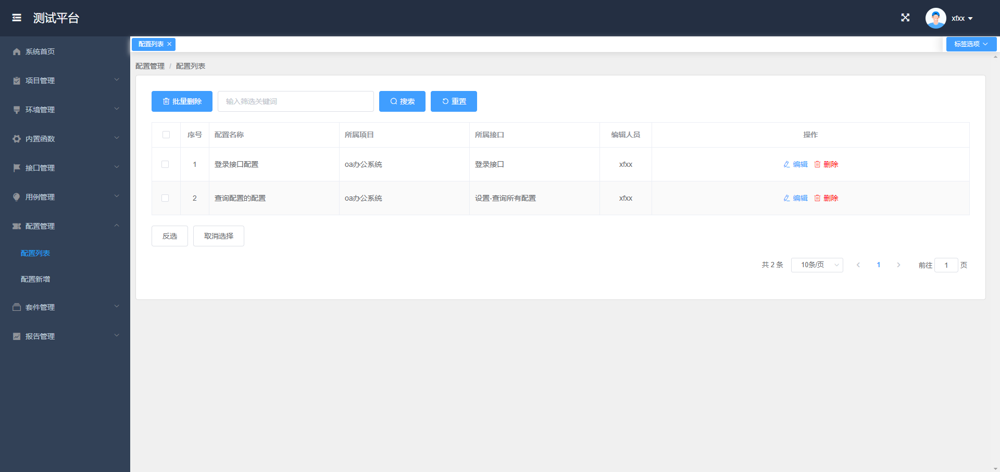

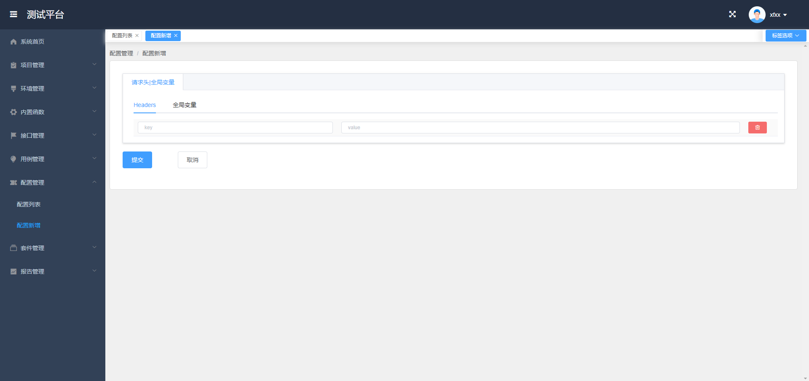

- 套件管理

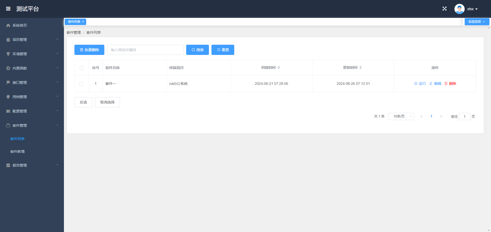

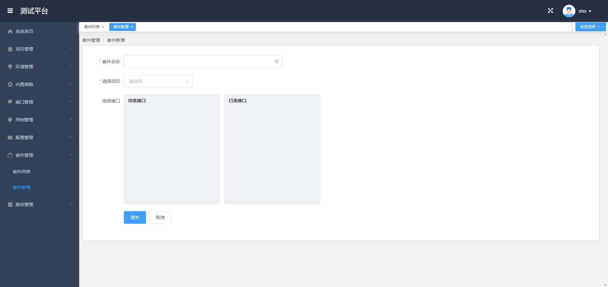


- 报告管理

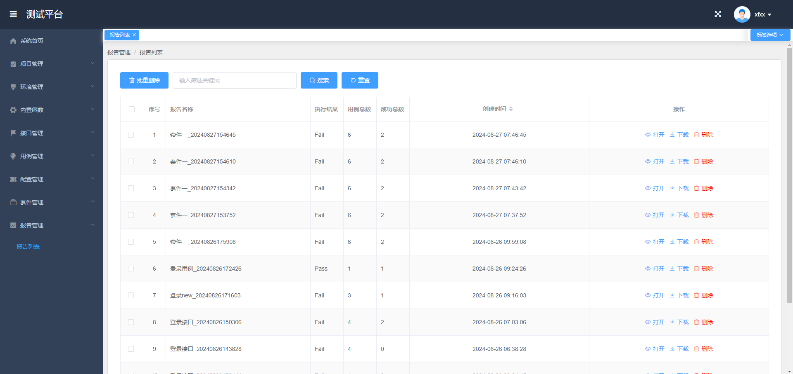

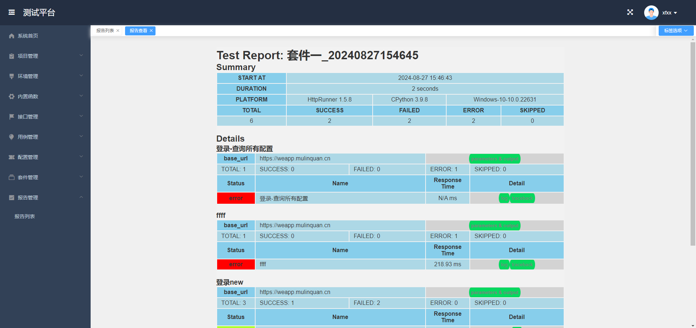
